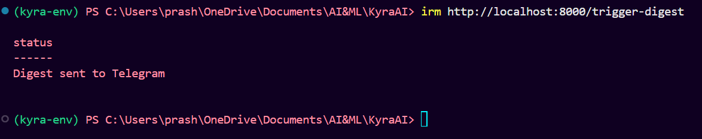

# Kyra AI — Personal Agent

Kyra is your personal AI agent. She:
- Summarises your WhatsApp chats, Twitter timeline, and top news every 2 hours
- Responds to your commands: set calendar events, post tweets, get summaries
- Runs 24/7 on Oracle Cloud free tier with Groq as the LLM brain

---

## Folder structure

```
KyraAI/
├── .env                     ← your API keys (copy from .env.example)
├── .env.example
├── .gitignore
├── requirements.txt
├── main.py                  ← FastAPI app (entry point)
├── config.py                ← loads all env vars
├── db.py                    ← SQLite models
├── scheduler.py             ← APScheduler (2-hour digest)
├── agents/
│   ├── summariser.py        ← builds and sends the digest
│   ├── intent_parser.py     ← understands your commands via Groq
│   └── calendar_agent.py    ← Google Calendar read/write
├── connectors/
│   ├── twitter_connector.py ← X API v2
│   └── news_connector.py    ← RSS + NewsAPI
└── whatsapp/
    ├── package.json
    └── bot.js               ← Node.js WhatsApp bot
```

---

## Setup guide

### 1. Get your free API keys

| Service | Where | Free tier |
|---------|-------|-----------|
| Groq | groq.com → API Keys | 14,400 req/day |
| Twitter/X | developer.twitter.com | 500 posts/mo |
| NewsAPI | newsapi.org | 100 req/day |
| Google Calendar | console.cloud.google.com | free |

### 2. Python environment

```bash
# In KyraAI folder
python3 -m venv kyra-env
source kyra-env/bin/activate          # Windows: kyra-env\Scripts\activate
pip install -r requirements.txt
```

### 3. Environment file

```bash
cp .env.example .env
# Edit .env and fill in all your API keys
```

### 4. Google Calendar credentials

1. Go to console.cloud.google.com
2. Create a project → Enable "Google Calendar API"
3. Credentials → Create OAuth 2.0 Client ID → Desktop app
4. Download JSON → save as `credentials.json` in KyraAI folder
5. First run will open a browser to authorise — do this once

### 5. WhatsApp bot setup

```bash
cd whatsapp
npm install
node bot.js
# A QR code appears in terminal
# Open WhatsApp on your phone → Linked Devices → Link a Device → scan QR
# After scan, session is saved — no QR needed again
```

### 6. Run Kyra (two terminals)

**Terminal 1 — WhatsApp bot:**
```bash
cd whatsapp
node bot.js
```

**Terminal 2 — Python backend:**
```bash
source kyra-env/bin/activate
python main.py
```

### 7. Test it

Open your WhatsApp and send yourself:
```
Kyra what's the news today
Kyra set my calendar for 10 AM to 12 PM, I want to study
Kyra post a tweet: Excited to build my own AI agent!
Kyra give me a summary
```

Or test the digest immediately:
```bash
curl http://localhost:8000/trigger-digest
```

---

## How commands work

You → WhatsApp message starting with "Kyra ..." →
bot.js forwards to FastAPI → intent_parser.py (Groq) →
structured JSON action → calendar/tweet/summary executed →
Kyra replies back to your WhatsApp

---

## Digest format (every 2 hours)

```
Hi! Here's your Kyra digest 🤖

📱 WhatsApp
• [Ravi] asked about the project deadline
• [Mom] sent you a message

🐦 Twitter
• @someone: interesting tweet...

📰 News
• India beats Australia in final over
• RBI holds repo rate steady
```

---

## Deploy to Oracle Cloud (later)

```bash
# On Oracle VM
git clone your-repo
cd KyraAI
pip install -r requirements.txt
cd whatsapp && npm install && cd ..
npm install -g pm2
pm2 start whatsapp/bot.js --name kyra-whatsapp
pm2 start "python main.py" --name kyra-api
pm2 save && pm2 startup
```


